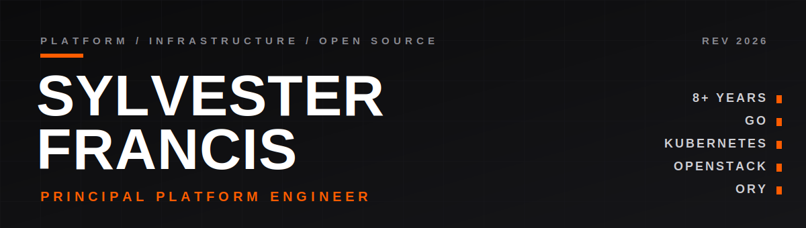

 

Platform and infrastructure engineering · 8+ years · Primary language Go

I architected a self-service developer platform from the ground up to drive a large-scale VMware vSphere to OpenStack migration, and I now lead an enterprise golden-image platform and own its identity and authorization layer. I build open-source tooling and write for an expert engineering audience.

## 01 / WORK

**GOLDEN-IMAGE PLATFORM**

Build, scan (Trivy, OpenSCAP), mandatory approval gate, promote, and multi-region OpenStack Glance distribution. Dual-cloud ephemeral builders (OpenStack and AWS EC2), Dagger-executed builds, DBOS durable workflows, and reliability hardening.

**AUTHORIZATION PLATFORM**

Hierarchical RBAC on Ory Keto relation tuples, multi-tenant hierarchy, check-time inheritance via Ory Permission Language, a live single-writer topology sync from OpenStack, identity and OIDC SSO on Ory Kratos, and audit logging.

**PLATFORM ORCHESTRATION**

A self-service internal developer platform, a Go OpenStack gateway (gophercloud), OpenTofu IaC on Kubernetes, and OpenTelemetry observability.

## 02 / STACK

## 03 / OPEN SOURCE

**01 · WatchDog** · `Go` · `AGPL-3.0`

Infrastructure monitoring with a hub-and-spoke WebSocket architecture. A central hub serves the dashboard; lightweight agents report from private networks over outbound-only connections.

[usewatchdog.dev](https://usewatchdog.dev) · [github.com/sylvester-francis/Watchdog](https://github.com/sylvester-francis/Watchdog)

**02 · Sentry** · `Go` · `Dagger`

Container-security Dagger module that integrates Trivy, Grype, and Snyk to run vulnerability scans inside CI/CD pipelines and report findings.

[github.com/sylvester-francis/Sentry](https://github.com/sylvester-francis/Sentry)

**03 · ctxforge** · `Rust`

CLI for manifest-driven LLM context bundles for agentic AI. Assembles reproducible context from a declarative manifest.

[github.com/sylvester-francis/ctxforge](https://github.com/sylvester-francis/ctxforge)

 

MORE

- [Compliance Auditor](https://github.com/sylvester-francis/Automated-Document-Compliance-Auditor) · GDPR and HIPAA document auditing with LLM analysis
- [Documentation Generator](https://github.com/sylvester-francis/DocumentationGenerator) · LangGraph multi-agent docs synced to Confluence
- [n8n Self-Hoster](https://github.com/sylvester-francis/n8n-selfhoster) · Ubuntu installer for n8n with Docker, PostgreSQL, and HTTPS
- [SLM TypeScript Model](https://github.com/sylvester-francis/slm-typescript-model) · LoRA fine-tuned small models for TypeScript code generation
- [OTA Deploy Tracker](https://github.com/sylvester-francis/ota-deploy-tracker) · progressive Kubernetes rollouts with FastAPI and Prometheus
- [Lintelligence](https://github.com/sylvester-francis/Lintelligence) · GitHub pull request review with GPT-4
- [Resource Reserver](https://github.com/sylvester-francis/Resource-Reserver) · CLI booking system with JWT, Typer, and FastAPI
- [TaskFlow](https://github.com/sylvester-francis/taskflow) · task tracking with JWT, FastAPI, and Kubernetes manifests

## 04 / WRITING

**Medium** · updated daily

<!-- MEDIUM-POST-LIST:START -->
- [The Frontier Model Is Not the Endgame. The Box on Your Desk Is.](https://medium.com/@sylvesterranjithfrancis/the-frontier-model-is-not-the-endgame-the-box-on-your-desk-is-0f6cbb0c6402?source=rss-b2e231d8e9db------2)
- [Commodity inference is the real GLM-5.2 story](https://medium.com/@sylvesterranjithfrancis/commodity-inference-is-the-real-glm-5-2-story-d83c5f626ea1?source=rss-b2e231d8e9db------2)
- [Your agent will crash, and it will overspend. I built the runner that survives both.](https://medium.com/@sylvesterranjithfrancis/your-agent-will-crash-and-it-will-overspend-i-built-the-runner-that-survives-both-fd35ffc7dbb4?source=rss-b2e231d8e9db------2)
- [Your AI agent doesn’t know when to quit. So I built a leash.](https://medium.com/@sylvesterranjithfrancis/your-ai-agent-doesnt-know-when-to-quit-so-i-built-a-leash-765b67736cba?source=rss-b2e231d8e9db------2)
- [Your Agent Crashed. It Paid for Everything Twice.](https://medium.com/@sylvesterranjithfrancis/your-agent-crashed-it-paid-for-everything-twice-47e01174c21c?source=rss-b2e231d8e9db------2)
<!-- MEDIUM-POST-LIST:END -->

**Substack** · updated daily

<!-- SUBSTACK-POST-LIST:START -->
- [The GLM-5.2 number that lands on your bill](https://techwithsyl.substack.com/p/the-glm-52-number-that-lands-on-your)
- [One idea, three tools](https://techwithsyl.substack.com/p/one-idea-three-tools)
- [Loop economics](https://techwithsyl.substack.com/p/loop-economics)
- [What Happens When Your Monitoring Can't See Behind the Firewall](https://techwithsyl.substack.com/p/what-happens-when-your-monitoring)
- [Building Sentry: A Container Security Scanner with Dagger](https://techwithsyl.substack.com/p/building-sentry-a-container-security)
<!-- SUBSTACK-POST-LIST:END -->

[Medium](https://medium.com/@sylvesterranjithfrancis) · [Substack](https://techwithsyl.substack.com) · [LinkedIn](https://www.linkedin.com/in/sylvesterranjith/) · [YouTube](https://www.youtube.com/@TechWithSyl)

## 05 / ACTIVITY

<picture>
  <source media="(prefers-color-scheme: dark)" srcset="https://raw.githubusercontent.com/sylvester-francis/sylvester-francis/output/github-snake.svg" />
  
</picture>

## 06 / SERVICES

Platform and infrastructure · Cloud architecture on Kubernetes · DevOps and container security · Code review · Career mentoring · Technical consulting

[Book a call](https://topmate.io/sylvester_francis)

## 07 / CONTACT

[Portfolio](https://sylvesterranjithfrancis.com) · [GitHub](https://github.com/sylvester-francis) · [LinkedIn](https://www.linkedin.com/in/sylvesterranjith/) · [Email](mailto:sylvesterranjithfrancis@gmail.com) · [Instagram](https://instagram.com/techwithsyl)

Waterloo, ON, Canada

BACKGROUND

 

- Master's in CS from VIT
- Big Data and Security certifications from Conestoga (High Distinction)
- Published ML researcher (brain tumor prediction using FCNNs)
- Built ETL pipelines and data engineering systems at OpenText
- 4K+ LinkedIn followers, 500+ professional connections
- Outstanding Achievement Award (OpenText), High Distinction in Big Data and in Security, ML Engineer Nanodegree (Udacity)

