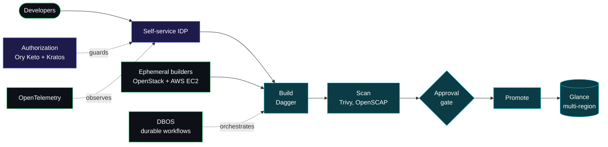
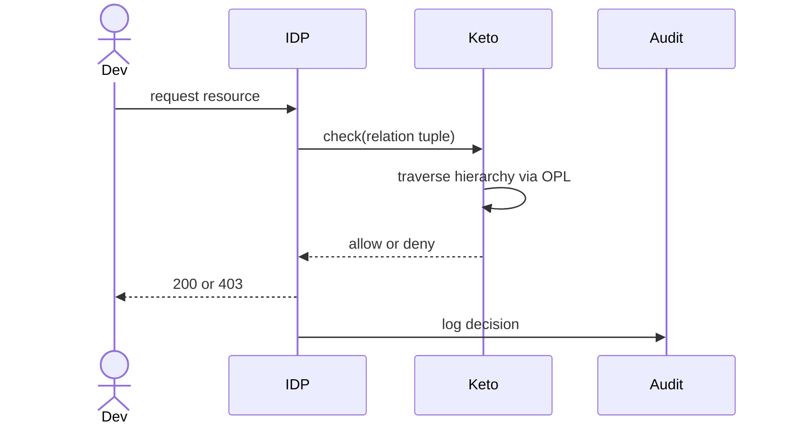

<div align="center">


<br/>

<a href="https://sylvesterranjithfrancis.com"></a>
<a href="https://www.linkedin.com/in/sylvesterranjith/"></a>
<a href="https://medium.com/@sylvesterranjithfrancis"></a>
<a href="https://techwithsyl.substack.com"></a>
<a href="https://www.youtube.com/@TechWithSyl"></a>
<a href="https://topmate.io/sylvester_francis"></a>
<a href="mailto:sylvesterranjithfrancis@gmail.com"></a>

<br/><br/>


<br/>


</div>

<br/>

```
 about.go x  |  stack.yaml  |  architecture.mmd  |  projects/  |  writing.md  |  contact.md
```

<table>
<tr>
<td valign="top" width="32%">

<strong>EXPLORER</strong>

```text
SYLVESTER-FRANCIS
│
├── about.go
├── stack.yaml
├── architecture.mmd
├── projects/
│   ├── open-source/
│   └── more/
├── writing.md
├── telemetry/
└── contact.md
```

</td>
<td valign="top" width="68%">

<strong><code>about.go</code></strong>

```go
package profile

// Principal Platform Engineer.
// 8+ years in platform and infrastructure engineering.
type Engineer struct {
    Role     string
    Primary  string
    Also     []string
    Owns     []string
    Writes   string
    Location string
}

func Sylvester() Engineer {
    return Engineer{
        Role:    "Principal Platform Engineer",
        Primary: "Go",
        Also:    []string{"TypeScript", "Python", "Rust"},
        Owns: []string{
            "golden-image platform",
            "authorization and identity layer",
            "platform orchestration",
        },
        Writes:   "open-source tooling and engineering deep dives",
        Location: "Waterloo, ON, Canada",
    }
}
```

</td>
</tr>
</table>

I architected a self-service developer platform from the ground up to drive a large-scale
VMware vSphere to OpenStack migration, and I now lead an enterprise golden-image platform and
own its identity and authorization layer. I work primarily in Go, build open-source tooling,
and write for an expert engineering audience.

```console
$ git log --oneline profile/career
now       principal platform engineer
recent    etl and data engineering at opentext
earlier   published ml researcher, master's in cs (vit)
```

<details>
<summary><code>$ cat profile/background.md</code></summary>

<br/>

- Master's in CS from VIT
- Big Data and Security certifications from Conestoga (High Distinction)
- Published ML researcher (brain tumor prediction using FCNNs)
- Built ETL pipelines and data engineering systems at OpenText
- 4K+ LinkedIn followers, 500+ professional connections
- Outstanding Achievement Award (OpenText), High Distinction in Big Data and in Security, ML Engineer Nanodegree (Udacity)

</details>

<br/>

---

<br/>

## `stack.yaml`

```yaml
languages:     [Go, TypeScript, Python, Rust]
cloud:         [Kubernetes, OpenStack, AWS, Azure]
build_and_iac: [Dagger, DBOS, OpenTofu, gophercloud]
identity:      [Ory Kratos, Ory Keto, Ory Hydra, Vault]
security:      [Trivy, OpenSCAP]
backend:       [NestJS, React, PostgreSQL]
observability: [OpenTelemetry]
ai_agentic:    [LangChain, LangGraph, MCP, Claude API, OpenAI API]
```

<br/>

---

<br/>

## `architecture.mmd`



| Service | State | Detail |
|---|:---:|---|
| **golden-image platform** |  | Build, scan (Trivy, OpenSCAP), mandatory approval gate, promote, and multi-region OpenStack Glance distribution. Dual-cloud ephemeral builders (OpenStack and AWS EC2), Dagger-executed builds, DBOS durable workflows, and reliability hardening. |
| **authorization platform** |  | Hierarchical RBAC on Ory Keto relation tuples, multi-tenant hierarchy, check-time inheritance via Ory Permission Language, a live single-writer topology sync from OpenStack, identity and OIDC SSO on Ory Kratos, and audit logging. |
| **platform orchestration** |  | A self-service internal developer platform, a Go OpenStack gateway (gophercloud), OpenTofu IaC on Kubernetes, and OpenTelemetry observability. |

<details>
<summary><code>$ cat authz_check.mmd</code></summary>

<br/>



</details>

<br/>

---

<br/>

## `projects/open-source/`

<table>
<tr>
<td width="33%" valign="top">

<h3 align="center"><a href="https://usewatchdog.dev">WatchDog</a></h3>

<div align="center">


</div>

Infrastructure monitoring with a hub-and-spoke WebSocket architecture. A central hub serves
the dashboard, and lightweight agents report from private networks over outbound-only
connections.

<div align="center">

<a href="https://usewatchdog.dev">usewatchdog.dev</a> &middot; <a href="https://github.com/sylvester-francis/Watchdog">GitHub</a>

</div>

</td>
<td width="33%" valign="top">

<h3 align="center"><a href="https://github.com/sylvester-francis/Sentry">Sentry</a></h3>

<div align="center">


</div>

Container-security Dagger module that integrates Trivy, Grype, and Snyk to run vulnerability
scans inside CI/CD pipelines and report findings.

<div align="center">

<a href="https://github.com/sylvester-francis/Sentry">GitHub</a>

</div>

</td>
<td width="33%" valign="top">

<h3 align="center"><a href="https://github.com/sylvester-francis/ctxforge">ctxforge</a></h3>

<div align="center">


</div>

CLI for manifest-driven LLM context bundles for agentic AI. Assembles reproducible context
from a declarative manifest.

<div align="center">

<a href="https://github.com/sylvester-francis/ctxforge">GitHub</a>

</div>

</td>
</tr>
</table>

<br/>

## `projects/more/`

<table>
<tr>
<td width="50%" valign="top">

<h3 align="center"><a href="https://github.com/sylvester-francis/Automated-Document-Compliance-Auditor">Compliance Auditor</a></h3>

<div align="center">


</div>

Audits documents for GDPR and HIPAA compliance. Identifies violations through pattern
matching and LLM analysis, then suggests remediations.

</td>
<td width="50%" valign="top">

<h3 align="center"><a href="https://github.com/sylvester-francis/DocumentationGenerator">Documentation Generator</a></h3>

<div align="center">


</div>

Multi-agent system on LangGraph that fetches code from GitHub, analyzes structure, generates
technical docs, and syncs them to Confluence.

</td>
</tr>
<tr>
<td width="50%" valign="top">

<h3 align="center"><a href="https://github.com/sylvester-francis/n8n-selfhoster">n8n Self-Hoster</a></h3>

<div align="center">


</div>

Ubuntu installer for n8n with Docker, PostgreSQL, HTTPS, security hardening, progress
tracking, and error recovery.

</td>
<td width="50%" valign="top">

<h3 align="center"><a href="https://github.com/sylvester-francis/slm-typescript-model">SLM TypeScript Model</a></h3>

<div align="center">


</div>

Small language models (1.5B to 7B) with LoRA fine-tuning for TypeScript code generation
across React, Next.js, Angular, and Node.js.

</td>
</tr>
<tr>
<td width="50%" valign="top">

<h3 align="center"><a href="https://github.com/sylvester-francis/ota-deploy-tracker">OTA Deploy Tracker</a></h3>

<div align="center">


</div>

Kubernetes deployment manager with a FastAPI backend, Streamlit dashboard, and Prometheus
monitoring for tracking progressive rollouts.

</td>
<td width="50%" valign="top">

<h3 align="center"><a href="https://github.com/sylvester-francis/Lintelligence">Lintelligence</a></h3>

<div align="center">


</div>

Reviews GitHub pull requests with GPT-4. Detects code smells, security issues, and
anti-patterns, then posts inline feedback.

</td>
</tr>
<tr>
<td width="50%" valign="top">

<h3 align="center"><a href="https://github.com/sylvester-francis/Resource-Reserver">Resource Reserver</a></h3>

<div align="center">


</div>

CLI booking system with JWT auth, conflict resolution, and reservation management. Built with
Python Typer and a FastAPI backend.

</td>
<td width="50%" valign="top">

<h3 align="center"><a href="https://github.com/sylvester-francis/taskflow">TaskFlow</a></h3>

<div align="center">


</div>

Task tracking with JWT authentication, role-based access control, and Kubernetes manifests.
Built with FastAPI and PostgreSQL.

</td>
</tr>
</table>

<br/>

---

<br/>

## `writing.md`

**Latest from Medium** (auto-updated daily)

<!-- BLOG-POST-LIST:START -->
- [Production Authorization: The Dual-Write Hazard, and a Blueprint for Machine Identity](https://medium.com/@sylvesterranjithfrancis/production-authorization-the-dual-write-hazard-and-a-blueprint-for-machine-identity-0ade10b53aa3?source=rss-b2e231d8e9db------2)
- [Authentication at the Edge: The Identity-Aware Proxy Pattern &lpar;and the One Header That Gets You…](https://medium.com/@sylvesterranjithfrancis/authentication-at-the-edge-the-identity-aware-proxy-pattern-and-the-one-header-that-gets-you-633cc2b6a2d2?source=rss-b2e231d8e9db------2)
- [RBAC Is Technical Debt: Zanzibar-Style Authorization in TypeScript](https://medium.com/@sylvesterranjithfrancis/rbac-is-technical-debt-zanzibar-style-authorization-in-typescript-42cefc94d4e2?source=rss-b2e231d8e9db------2)
- [I’m Tired of Being My AI’s Short-Term Memory. So I Built ctxforge.](https://medium.com/@sylvesterranjithfrancis/im-tired-of-being-my-ai-s-short-term-memory-so-i-built-ctxforge-eda0a5889d8f?source=rss-b2e231d8e9db------2)
- [I Built an AI Tutor That Runs Entirely on a Phone, Part 2: The Architecture](https://medium.com/@sylvesterranjithfrancis/i-built-an-ai-tutor-that-runs-entirely-on-a-phone-part-2-the-architecture-66de6d6bf087?source=rss-b2e231d8e9db------2)
<!-- BLOG-POST-LIST:END -->

<div align="center">

| Platform | What I write about |
|:---:|:---|
| <a href="https://medium.com/@sylvesterranjithfrancis"></a> | Platform engineering, infrastructure, and agent design for an expert audience |
| <a href="https://techwithsyl.substack.com"></a> | DevOps tooling, container security, and Dagger deep dives |
| <a href="https://www.linkedin.com/in/sylvesterranjith/"></a> | Engineering notes, industry trends, and developer mentoring |
| <a href="https://www.youtube.com/@TechWithSyl"></a> | Tutorials, project walkthroughs, and coding sessions |

</div>

<br/>

---

<br/>

## `telemetry/`

<div align="center">


<br/><br/>


<br/><br/>

<picture>
  <source media="(prefers-color-scheme: dark)" srcset="https://raw.githubusercontent.com/sylvester-francis/sylvester-francis/output/github-contribution-grid-snake-dark.svg" />
  <source media="(prefers-color-scheme: light)" srcset="https://raw.githubusercontent.com/sylvester-francis/sylvester-francis/output/github-contribution-grid-snake.svg" />
  
</picture>

</div>

<br/>

---

<br/>

## `services.md`

<div align="center">

```
+---------------------------+---------------------------+---------------------------+
|     PLATFORM & INFRA      |   CLOUD ARCHITECTURE      |    DEVOPS & SECURITY      |
|                           |                           |                           |
|  Self-service platforms,  |  OpenStack, AWS, Azure    |  CI/CD, container         |
|  golden-image pipelines,  |  infrastructure and IaC   |  security, monitoring,    |
|  and developer tooling    |  on Kubernetes            |  and deploy automation    |
+---------------------------+---------------------------+---------------------------+
|    CAREER MENTORING       |      CODE REVIEW          |  TECHNICAL CONSULTING     |
|                           |                           |                           |
|  1:1 sessions for         |  Reviews, best            |  System architecture      |
|  career transitions,      |  practices, and           |  and technology           |
|  interview prep, resume   |  technical mentorship     |  strategy for teams       |
+---------------------------+---------------------------+---------------------------+
```

<br/>

<a href="https://topmate.io/sylvester_francis"></a>

</div>

<br/>

---

<br/>

## `contact.md`

<div align="center">

<a href="mailto:sylvesterranjithfrancis@gmail.com"></a>
<a href="https://www.linkedin.com/in/sylvesterranjith/"></a>
<a href="https://topmate.io/sylvester_francis"></a>
<a href="https://github.com/sylvester-francis"></a>
<a href="https://instagram.com/techwithsyl"></a>

<br/><br/>

**Based in Waterloo, ON, Canada**

</div>


